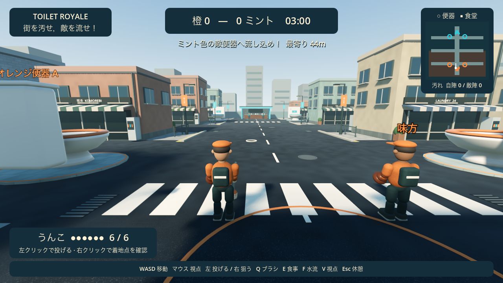
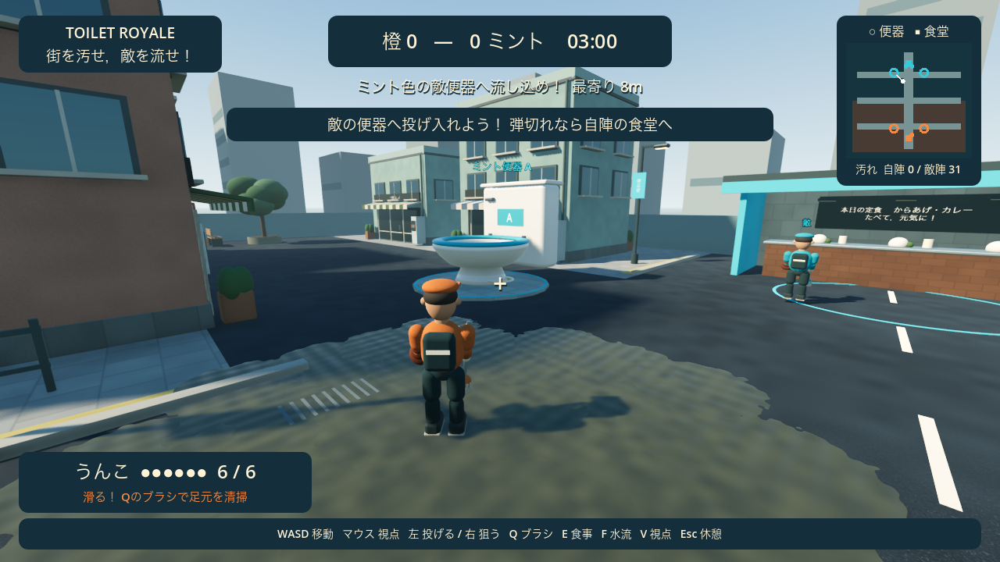

# トイレロワイヤル / Toilet Royale

**街を汚せ，敵を流せ！**

## ▶ ブラウザで遊ぶ

**<https://nagajin.github.io/toilet-royale/>**

インストール不要．リンクを開いて「街へ出る！」を押すだけです．
初回だけ約10MBの読み込みがあり，開始直後の数秒はシェーダの準備で動きが重くなります．
PCとマウスが必要です（スマートフォン・タッチ操作には未対応）．

街を舞台に，うんこを投げて敵の便器へ流し込む3Dチーム対戦ゲーム．
地面を汚して相手を滑らせ，ブラシで清掃し，食堂で食事をして補給します．
自陣の便器の水流で敵プレイヤー本人を流すこともできます．

現在の本線は **v0.5 商店街の質感と動き**．ゲームらしさを保ち，街・素材・キャラクターの動きをリアル寄りに更新しました．



## 起動

macOSでは **`run-game.command` をダブルクリック**．Godotが `/Applications/Godot.app` にあればPATH設定は不要です．

```bash
./run-game.command
# エディタで開く
./run-game.command --editor
```

起動ファイルはクラス登録を自動インポートします．Godotを直接使う場合：

```bash
godot --path game --headless --editor --import --quit
godot --path game
```

Godot 4.7 / macOS / Metalで確認済み．追加アセットのダウンロードは不要です．

## 今できること

- 自分＋味方CPU 対 敵CPU2体の2対2．3分間で得点の多いチームが勝ち，同点は引き分け．
- 敵の便器へうんこを投げ入れると1点．自陣の便器や汚れ面積は得点になりません．
- 地面に着弾すると汚れが残り，その上では慣性が強くなって滑ります．ブラシで汚れを除去できます．
- 自陣の食堂で1.5秒食事をすると6個まで補給．敵の食堂では補給できません．
- 自陣の便器付近で水流を作動させると，6m以内の敵を吸い込んで自陣へ戻します．味方には効きません．
- 道路・建物・食堂がある街を生成し，チームごとに2基の便器を配置．メニューから新しい配置を生成できます．
- 肩越しの三人称／一人称を切り替え可能．CPUも移動・投擲・補給・清掃・水流を使用します．

## v0.5の見た目と手触り

- 窓枠・庇・店先・街灯・排水溝・植栽・遠景の建物がある商店街．
- 舗装・レンガ・タイル・布の細かな質感，空の反射，柔らかな影と接地部分の陰影．
- 中が空いた丸い陶器の便器，波紋・渦・水しぶき．汚れには湿った光沢と不規則な縁．
- 肘・膝のあるキャラクターと，歩行・ジャンプ・投擲・清掃・食事・水流に巻き込まれる動き．
- 一人称の手元，走行時のわずかな視野変化，着地の沈み込み．
- 距離に応じた足音・投擲・着弾・ブラシ・水流・補給の効果音．Escメニューで消音可能．

形状・素材・音はコードで生成します．外部モデルや音源の取得は不要です．

## 操作

| 操作 | キー |
|---|---|
| 移動・視点 | WASD・マウス |
| 投げる | 左クリック |
| 狙う・予測軌道を見る | 右クリック長押し |
| 清掃・近くの敵を押し出す | Q長押し |
| 食堂で食事・補給 | E長押し |
| 自陣の便器の水流 | F |
| ジャンプ・走る | Space・Shift |
| 一人称／三人称 | V |
| 一時停止・マウス解放 | Esc |
| 試合中にやり直す | R |

開始メニューの「街へ出る！」を押すとマウスを捕捉します．Escまたはウィンドウのフォーカス喪失で一時停止します．



## 検証

```bash
./run-game.command --headless --script res://tests/test_city.gd --fixed-fps 60
./run-game.command --headless --script res://tests/test_city_presentation.gd --fixed-fps 60
./run-game.command --script res://tests/capture_city.gd --fixed-fps 60
./run-game.command --script res://tests/capture_city_motion.gd --fixed-fps 60
```

50項目の実行テストに，実投擲による得点・着弾，滑り・清掃，食堂補給，敵の水流撃退，3分間のCPU試合完走を含みます．
追加の16項目で，一人称の手元・復帰時の姿勢，消音，演出数の制限・終了・再試合時の除去を確認します．
画面キャプチャは `/tmp/toilet-city-*.png` に保存します．

## 開発状況

現在はCPU相手に操作とルールを試すプロトタイプです．街・キャラクターは手続き生成のモデルで，AIの強さや操作感は調整段階．
街モードの対人・オンライン・分割画面・パッド操作・BGMは未実装です．

- [遊びの仕様](specs/v0_4_city_battle.md) / [v0.5の表現](specs/v0_5_city_presentation.md)
- [企画](docs/PROJECT_BRIEF.md) / [ゲームデザイン](docs/GAME_DESIGN.md)
- [開発ログ](docs/DEVELOPMENT_LOG.md)
- 本線：`game/scenes/city_battle.tscn` / `game/scripts/city/`

## ブラウザ版について

ブラウザではデスクトップ版と描画方式が異なります．

- ブラウザはVulkanを使えないため **Compatibility レンダラ**（WebGL 2.0）で動きます．
  SSAO・SSIL・TAA はこの方式に無く無効になります．形状・材質・影・効果音はそのままです．
- Retinaでは画素数が4倍になり重いので，ブラウザ版は **CSSピクセル**で描画します．
  元に戻すなら `game/project.godot` の `window/dpi/allow_hidpi.web` の行を消してください．
- **スレッド無し**で書き出しているので `COOP`/`COEP` ヘッダが不要で，GitHub Pagesにそのまま置けます．
- 日本語表示のため **Noto Sans JP** を同梱しています（`game/fonts/`，SIL OFL 1.1）．
  ブラウザにはOSのフォントが無く，同梱しないと日本語がすべて豆腐（□）になります．

デスクトップ版（`run-game.command`）は従来どおり Forward+ で，SSAO・SSIL・TAAも有効です．

### 書き出しとデプロイ

Godot 4.7 のエクスポートテンプレートが必要です（初回のみ，エディタの「エクスポートテンプレートの管理」から）．

```bash
godot --headless --path game --import --quit
godot --headless --path game --export-release "Web" ../build/web/index.html
```

`build/web/` の中身を `.nojekyll` と一緒に `gh-pages` ブランチへ push すると公開されます．

## 過去の試作

v0.3の便器ゴール型ボール競技は，今回確認した構想とは異なるため本線から外しました．技術検証として保存しています．

```bash
# v0.3 ボール競技
./run-game.command res://scenes/toilet_goal_prototype.tscn
# v0.2 水流から逃げる試作
./run-game.command res://scenes/main.tscn
# v0.1 2D試作のテスト
node prototype/test_sim.js
```
